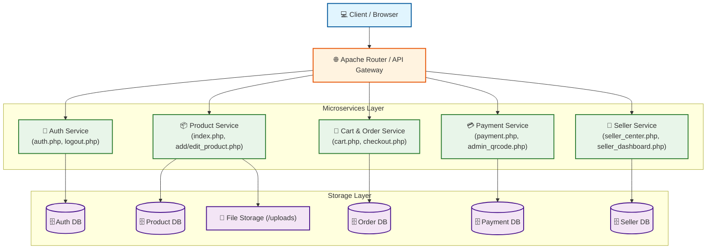
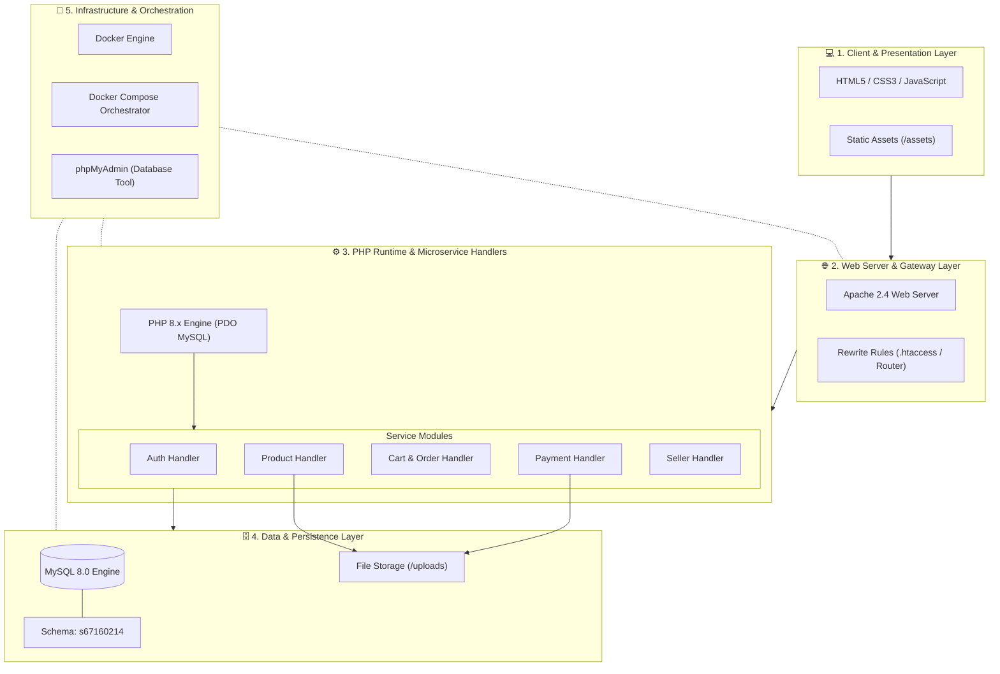

# 🛒 E-Commerce System Integration & REST API

โปรเจกต์ระบบร้านค้าออนไลน์ (E-Commerce Web Application) พร้อมสถาปัตยกรรม Microservices และ Containerization ด้วย Docker

---

## 📊 1. การประเมินผลงานตนเอง (Self-Assessment)
* **ความคืบหน้าภาพรวม:** `90%` (จากทั้งหมด 100%)
* **สถานะปัจจุบัน:** พัฒนาระบบงานหลักทั้งหมดเรียบร้อยแล้ว ติดตั้ง Container Environment และตั้งค่าฐานข้อมูลเรียบร้อย พร้อมสำหรับการทดสอบและใช้งาน

---

## 📌 2. รายงานสรุปสถานะการทำงาน (Progress Report)

### ✅ ส่วนที่เสร็จสิ้น (Completed)
* **ระบบสิทธิ์และผู้ใช้:** สมัครสมาชิก, ล็อกอิน, ล็อกเอาต์ (`auth.php`, `logout.php`)
* **ระบบสินค้า:** หน้ารายการสินค้า, เพิ่ม/แก้ไขสินค้า (`index.php`, `add_product.php`, `edit_product.php`)
* **ระบบสั่งซื้อ:** ตะกร้าสินค้า, สั่งซื้อสินค้า, แจ้งชำระเงิน (`cart.php`, `checkout.php`, `payment.php`)
* **ระบบผู้ขาย:** ลงทะเบียนผู้ขาย, แดชบอร์ดผู้ขาย, ศูนย์จัดการร้านค้า (`apply_seller.php`, `seller_center.php`, `seller_dashboard.php`)
* **Docker Setup:** กำหนดไฟล์ `Dockerfile` และ `docker-compose.yml` สำหรับรัน Web API, MySQL และ phpMyAdmin

### ⏳ ส่วนที่ยังไม่เสร็จ (Pending)
* **ระบบแอดมิน:** ตรวจสอบอนุมัติสลิปชำระเงิน (`admin_qrcode.php`)
* **Security & Validation:** ปรับปรุงมาตรการตรวจสอบข้อมูลเข้า (Input Validation) และความปลอดภัยของ API Endpoint เพิ่มเติม

---

## 🏗️ 3. Architecture & Tech Stack Diagrams

### 3.1 Microservices Architecture Diagram


### 3.2 Technology Stack Diagram (Integrated with Services Architecture)


---

## 📡 4. REST API Specification

### Authentication & User Management
* `POST /api/v1/auth/register` - สมัครสมาชิก
* `POST /api/v1/auth/login` - เข้าสู่ระบบ (`auth.php`)
* `POST /api/v1/auth/logout` - ออกจากระบบ (`logout.php`)
* `GET /api/v1/auth/me` - ดึงข้อมูลผู้ใช้ปัจจุบัน

### Product Management
* `GET /api/v1/products` - ดึงรายการสินค้าทั้งหมด (`index.php`)
* `GET /api/v1/products/{id}` - ดึงรายละเอียดสินค้า
* `POST /api/v1/products` - เพิ่มสินค้าใหม่ (`add_product.php`)
* `PUT /api/v1/products/{id}` - แก้ไขสินค้า (`edit_product.php`)
* `DELETE /api/v1/products/{id}` - ลบสินค้า

### Cart & Orders
* `GET /api/v1/cart` - ดึงรายการในตะกร้า (`cart.php`)
* `POST /api/v1/cart/items` - เพิ่มสินค้าลงตะกร้า
* `POST /api/v1/orders/checkout` - เช็กเอาต์สั่งซื้อ (`checkout.php`)

### Seller System
* `POST /api/v1/sellers/apply` - สมัครเป็นผู้ขาย (`apply_seller.php`)
* `GET /api/v1/sellers/dashboard` - ดูแดชบอร์ดร้านค้า (`seller_dashboard.php`)
* `GET /api/v1/sellers/products` - รายการสินค้าในร้าน (`seller_center.php`)

### Payments
* `POST /api/v1/payments/upload-slip` - แจ้งชำระเงิน (`payment.php`)
* `GET /api/v1/admin/payments/qrcode` - [Admin] ดูสลิป QR Code (`admin_qrcode.php`)

---

## 🚀 5. วิธีการรันโปรเจกต์ด้วย Docker

1. **สั่งรัน Container ทั้งหมด:**
   ```bash
   docker compose up -d --build
   ```

2. **หากต้องการล้างข้อมูลฐานข้อมูลและรันระบบใหม่ทั้งหมด:**
   ```bash
   docker compose down -v
   docker compose up -d --build
   ```

3. **ช่องทางการเข้าใช้งาน:**
   * **Web Application / REST API:** [http://localhost:8080](http://localhost:8080)
   * **phpMyAdmin:** [http://localhost:8081](http://localhost:8081)

4. **ข้อมูลการเชื่อมต่อฐานข้อมูล (Database Connection Credentials):**
   * **Host:** `db`
   * **Database Name:** `s67160214`
   * **Username:** `s67160214`
   * **Password:** `W5xPdkn9`
   * **Root Password:** `rootpassword`
   * **MySQL Internal Port:** `3306`
